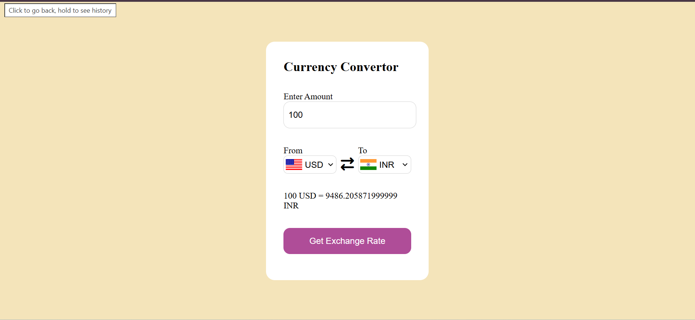

# Currency Converter

A web-based currency converter that uses REST API integration 
to fetch real-time exchange rates and convert currencies.

## Technologies Used
- HTML
- CSS
- JavaScript
- Fetch API
- REST API

## Features
- Convert between multiple currencies
- Real-time exchange rates
- Responsive design

- ## Project Screenshot

## Live Demo
[Click here to view the project](https://nidhi-currency-convertor.netlify.app/)

## Author
Nidhi Soni
